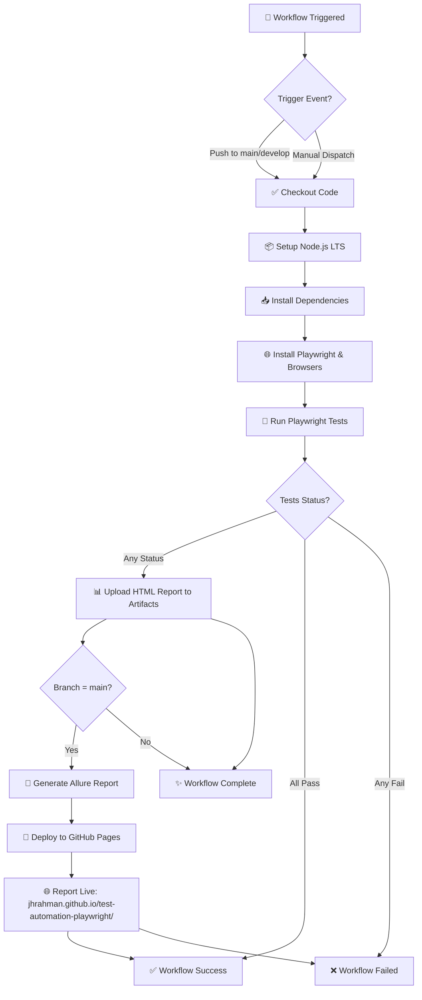

# Playwright Practices — Web Automation

[](https://jhrahman.github.io/test-automation-playwright/)

A hands-on collection of Playwright end-to-end tests written in **TypeScript** for learning Playwright APIs, locators, frames, dropdowns, forms, and test reporting.

## About this repository

- Purpose: Demonstration and practice repository for Playwright test scenarios and automation patterns.
- Language: TypeScript with strict type checking enabled.
- Contents: Playwright test specs in [tests/](tests), Playwright configuration in [playwright.config.ts](playwright.config.ts), TypeScript configuration in [tsconfig.json](tsconfig.json), and example HTML report in `playwright-report/`.

## Tests

- All automated tests live under [tests/](tests) with `.spec.ts` extension.
- Tests are designed to demonstrate common Playwright patterns: locators, form interactions, frames, dropdowns, assertions, device emulation, and test reporting.
- All test files have full type annotations for parameters and variables.

## Configuration

**TypeScript Configuration** ([tsconfig.json](tsconfig.json)):
- Strict mode enabled for full type safety
- ES2020 target with Node module resolution
- Includes Playwright and Node.js type definitions

**Playwright Configuration** ([playwright.config.ts](playwright.config.ts)):
- Fully parallel execution; 2 workers on CI, unlimited locally
- Retries: 3 on CI, disabled locally
- Global timeout: 120s, assertion timeout: 20s
- Reporters: HTML, Allure Playwright (with [GitHub Pages deployment](https://jhrahman.github.io/test-automation-playwright/)), and list
- Traces: Always enabled for debugging
- Screenshots/videos: Retained on failures
- Slow motion: 1000ms on local for debugging, disabled on CI
- Multiple browser projects: Chromium, Firefox, WebKit, Mobile Chrome (Pixel 8), Mobile Safari (iPhone 15 Pro)

## Dependencies

Key dependencies in `package.json`:

- `@playwright/test` — Playwright test runner
- `@types/node` — Node.js type definitions
- `dotenv` — environment variable loading

## Local quickstart

Install dependencies and Playwright browsers:

```bash
npm install
npx playwright install
```

Run all tests:

```bash
npx playwright test
```

Open the HTML report:

```bash
npx playwright show-report
```

Run a single test file:

```bash
npx playwright test tests/your-test.spec.ts
```

Run in headed mode (interactive):

```bash
npx playwright test --headed
```

Run with single worker and retries disabled (for debugging):

```bash
npx playwright test --workers=1 --retries=0
```

## GitHub Actions CI

This repository includes a GitHub Actions workflow at [.github/workflows/playwright.yml](.github/workflows/playwright.yml) that automates testing, reporting, and deployment of Allure reports to GitHub Pages.

### Workflow Triggers

The workflow runs automatically on:
- **Push to `develop` or `main` branch** — Runs tests and generates reports
- **Manual dispatch** — Trigger manually from the GitHub Actions tab

### Workflow Steps

1. **Checkout Repository** — Clones the repository code
2. **Setup Node.js** — Installs the latest LTS version
3. **Install Dependencies** — Runs `npm ci` to install exact locked versions
4. **Install Playwright Browsers** — Installs browser binaries and Linux system dependencies
5. **Run Playwright Tests** — Executes all tests with `npx playwright test` (continues even if tests fail)
6. **Upload Playwright HTML Report** — Archives the HTML report as a workflow artifact (retained 30 days)
7. **Generate Allure Report** — Creates Allure report (main branch only)
8. **Deploy Allure Report to GitHub Pages** — Publishes report to gh-pages branch (main branch only) — viewable at [Allure Report](https://jhrahman.github.io/test-automation-playwright/)
9. **Fail Workflow if Tests Failed** — Marks the workflow as failed if any tests failed (but reports are still published)

### Environment Configuration

The workflow reads credentials from repository secrets:
- `TEST_USERNAME` — Username for test authentication
- `TEST_PASSWORD` — Password for test authentication

Configure these in your repository settings **Settings → Secrets and variables → Actions**.

### Workflow Reports

**HTML Report:**
- Generated locally: `playwright-report/`
- Available in workflow: Download from Artifacts tab after workflow completes
- Retained for 30 days

**Allure Report:**
- Generated and deployed on `main` branch pushes only
- Automatically published to GitHub Pages
- Viewable at: [Allure Report](https://jhrahman.github.io/test-automation-playwright/)

### Workflow Execution Flow



### Key Features

- **Continues on Test Failure** — Tests failing doesn't stop report generation
- **Conditional Deployment** — Allure reports only publish from `main` branch (prevent staging reports overwriting production)
- **Artifact Retention** — HTML reports kept for 30 days for historical reference
- **Parallel Execution** — Tests run in parallel (2 workers) for faster CI feedback
- **Multi-Browser Testing** — Runs across Chromium, Firefox, WebKit, and mobile devices
- **Retry Policy** — 3 retries on CI for flaky tests

## Troubleshooting

- Use `--workers=1` and `--retries=0` when debugging locally.
- Run in debug mode:

```bash
npx playwright test tests/your-test.spec.ts --headed --debug
```

- For detailed trace collection:

```bash
npx playwright test --trace on-first-retry
```

---
